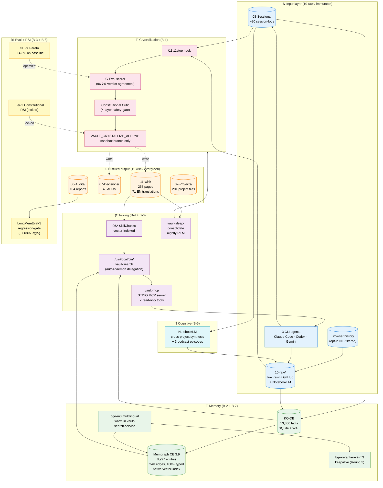

# Architecture overview — the 8-axis self-improving vault

This is the single-page architectural answer to "what's in this repo?". For the
narrative, read [What I learned building a self-improving Obsidian-vault in 5
hours](what-i-learned-building-self-improving-vault.en.md). For the per-axis
deep-dive, follow the links in the diagram.

## The one-screen mental model

## What's NOT in the diagram

A handful of supporting infrastructure is deliberately omitted to keep the
mental model under one screen:

- The **4-layer atomic-write safety** (ENV gate / `vault_atomic.py` shared lib /
  flock-mutex per cron / git pre-commit hook on forbidden targets) — see
  [[multi-layer-safety-gate.en]]
- The **session-isolation matrix** (`$CLAUDE_CODE_SESSION_ID` / Codex auto-detect /
  Gemini SessionStart hook) — see [[cli-session-id-env-var-matrix.en]]
- The **subagent-fanout pattern** ($0 bulk-LLM via Claude Code's `Task` tool) —
  see [[claude-code-subagent-fanout.en]]
- The **regression CI-gate** for retrieval quality (LongMemEval-S Pytest, daily
  02:45 cron) — see `.vault-eval/regression/`
- The **launch infrastructure** (mkdocs-material site, 3 NotebookLM 2-host
  podcasts, asciicast demo, llms.txt)

## How to read this diagram

1. **Top layer (📥)** = where new information enters. Three sources: agent
   session-logs, scraped/imported external content, and (opt-in) the user's
   own browser history.
2. **Crystallization (🔮)** = the path that promotes "this was learned in a
   session" → "this is evergreen wiki". G-Eval + Constitutional Critic both
   gate the apply step.
3. **Memory (🧠)** = the dual-store. KO-DB is the structured triplet store
   (SQLite, ~60 ms top-k). Memgraph is the entity-graph + vector-index
   (~1 ms native search after Round 2 keepalive fix).
4. **Distilled output (✨)** = the durable artifact. This is what gets
   committed and what readers consume on the docs site.
5. **Tooling (🛠️)** = the CLI surface used by agents AND humans. The new
   `vault-mcp` STDIO server (Round 3) bridges this layer to any
   MCP-compatible client.
6. **Eval + RSI (📊)** = the feedback loop. LongMemEval-S guards retrieval
   quality; GEPA proposes prompt improvements; Tier-2 Constitutional RSI is
   the (locked) bridge for the agent to mutate its own prompts.
7. **Cognitive (🎙️)** = NotebookLM as a cross-project synthesis subroutine.
   Its output is treated as RAW input, NOT direct wiki — every
   NotebookLM-generated insight must pass through the crystallization gate.

## Where to dive deeper

| Axis | Wiki | ADR |
|---|---|---|
| B-1 Crystallization | [[Crystallization-protocol.en]] | `07-Decisions/2026-05-12 sv-5 crystallization automation arch.md` |
| B-2 Memory | [[hybrid-bm25-semantic-rrf-pattern.en]] | `07-Decisions/2026-05-12 sv-1 memory architecture arch.md` |
| B-3 Eval | [[g-eval-bias-mitigation-pattern.en]] | `07-Decisions/2026-05-12 sv-7 continuous evaluation arch.md` |
| B-4 Tools | [[per-project-context-skill-pattern]] | `07-Decisions/2026-05-12 sv-4 tool composition arch.md` |
| B-5 NotebookLM | [[notebooklm-cli-gotchas.en]] | `07-Decisions/2026-05-12 sv-8 notebooklm cognitive layer arch.md` |
| B-6 Multi-agent | [[claude-code-subagent-fanout.en]] | `07-Decisions/2026-05-12 sv-3 multi-agent orchestration arch.md` |
| B-7 Knowledge graph | [[memgraph-ce-feature-limits.en]] | `07-Decisions/2026-05-12 sv-6 world-model knowledge-graph arch.md` |
| B-8 RSI | [[sv-02-recursive-self-improvement]] | `07-Decisions/2026-05-12 sv-2 recursive self-improvement arch.md` |

## Footprint (post-v1.0.1)

| What | Count |
|---|---|
| Evergreen wikis | **258** |
| English translations | **71** |
| ADRs | **45** |
| Audits | **104** |
| Sessions | ~80 |
| KO-DB facts | **13,800+** |
| Memgraph entities | **8,997** (100% typed) |
| Memgraph edges | **24,606** |
| Indexed skills | **962** |
| Cron jobs | **18+** flock-mutex |
| /usr/local/bin scripts | **70+** |

## Related

- [[Karpathy-LLM-Wiki-pattern.en]] — the foundational pattern
- [[multi-layer-safety-gate.en]] — the 4-layer atomic-write story
- [[Johnny-Decimal-prefix.en]] — folder structure
- [[what-i-learned-building-self-improving-vault.en]] — narrative essay
