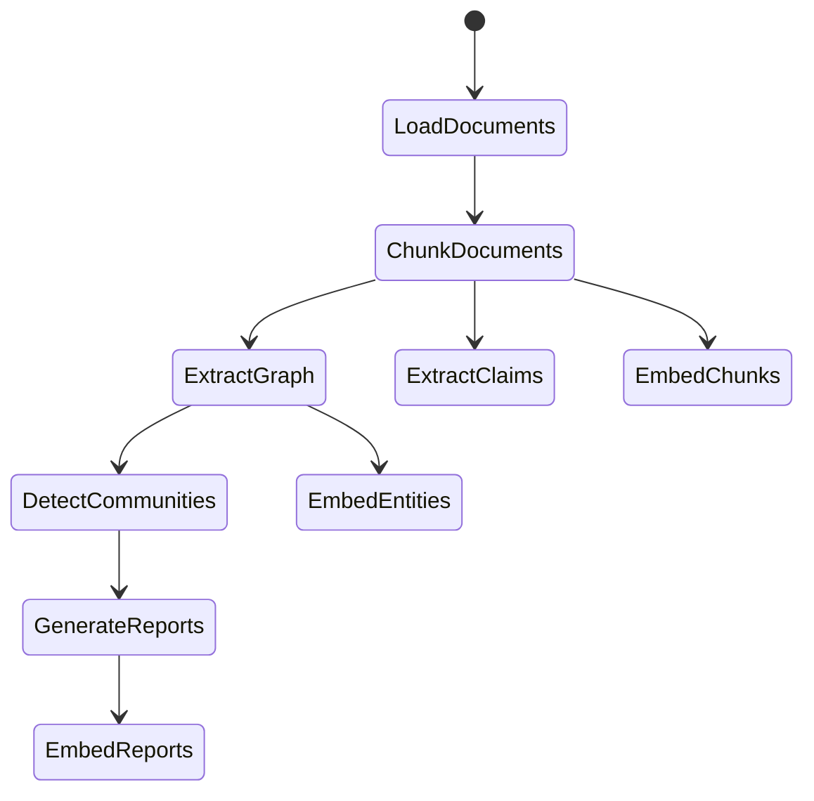

# GraphRAG community-summary pattern

A **Microsoft GraphRAG** (research 2024, arXiv:2404.16130) a "narrative private data over LLM discovery" területen ipari-szintű referencia. Magja: az LLM extrahál egy entity-relation graphot, a **Leiden-algoritmus** klaszterezi hierarchikus communities-be, minden community-re **előre legenerál egy LLM-summary-t**, és query-kor ezeket a summary-ket szintetizálja válaszként. **Ez egyedülálló: query-focused holisztikus summarization** — ahol a chunk-similarity konceptuálisan kudarcot vall.

## Frontier-context

- **Forrás:** [github.com/microsoft/graphrag](https://github.com/microsoft/graphrag), [microsoft.github.io/graphrag](https://microsoft.github.io/graphrag), [arXiv:2404.16130](https://arxiv.org/pdf/2404.16130)
- **Licenc:** MIT (Microsoft Research)
- **Maintainers:** Microsoft Research, Darren Edge et al.
- **Megjegyzés:** "demonstration, not officially supported offering"
- **Warning a docs-ban:** "indexing can be an expensive operation, start small"

## Architektúra — indexelő pipeline



**Knowledge Model** — output-abstraction a storage fölött; pipeline:

1. **LoadDocuments → ChunkDocuments** — méretarányos chunkolás
2. **ExtractGraph** — LLM-mel `(entity, relation, entity)` triplet-ek + opcionálisan **ExtractClaims** (statement-szintű állítás-tár)
3. **DetectCommunities** — **Leiden-algoritmus** a graphon → hierarchikus clusters (level-0, level-1, level-2 communities)
4. **GenerateReports** — minden community-re LLM-pass: "írj egy összefoglalót a community által képviselt témáról"
5. **EmbedChunks / EmbedEntities / EmbedReports** — három független vector-index

## Három query-mód

| Mód | Mit csinál | Mire jó |
|---|---|---|
| **Global Search** | Top-level community-summary-ket szintetizál a query alapján | **"Melyek a fő témák?"**, holisztikus, sense-making |
| **Local Search** | Specific entity-ből kiindulva graph-neighborhood + chunk-fetch | Pontos faktoid: "mit csinált X?" |
| **Drift Search** | Hibrid — globálból indul, lokál-felé "drift-el" | Multi-hop with high-level grounding |

## Factory-pattern (deep customization)

A GraphRAG architektúra **factory-pattern**-ekre van építve, ami **reusable software-engineering minta** bármilyen RAG-stack-hez:

- `completion_factory` — LLM provider swap (LiteLLM default, custom registrable)
- `cache_factory` — file / blob / CosmosDB
- `storage_factory` — output tables
- `vector_store_factory` — lancedb / Azure AI Search / CosmosDB
- `input_reader` — text / CSV / JSON / custom
- `workflows/factory` — egész pipeline override

**Reusable pattern:** string-name-alapú registration, override default, override per-instance.

## Mintázat (generic-reusable)

```
[Corpus]
   ↓
[Chunk + LLM-extract entity/relation graph]
   ↓
[Leiden community-detection — hierarchical]
   ↓
[LLM-summary per community (offline batch)]
   ↓
[Vector-embed chunks, entities, reports]
   ↓
====== query-time ======
   ├── Global: community-summary fan-in → synthesis
   ├── Local: entity-anchor → neighborhood+chunks
   └── Drift: global → local progressive zoom
```

## Hogyan releváns a vault-meta SV-nek

- **SV-6 World-model / KG** — a saját B-7 entity-graph (Memgraph, 8997 entity / 13812 relation, ref: [[../11-wiki/sv-06-world-model-knowledge-graph]]) **nem futtat Leiden community-detection-t**. **Konkrét gap.** Memgraph MAGE-ben elérhető a community-detection (Louvain/Leiden), érdemes megpróbálni a saját vault-on. Becsült értékadás: "melyek a vault fő témái" / "mely projektek tartoznak össze" típusú meta-query-k.
- **graphify Tier-2 már Leiden-alapú** — a saját graphify-bemenetünk (ref: [[../11-wiki/two-tier-graph-extraction]]) **már** Leiden community-detection-t használ (5846 node, 437 community). **Részben már beépített.** Hiányzó: per-community LLM-summary réteg (GraphRAG fő-trükkje).
- **Indexing-cost warning** — Microsoft expliciten figyelmeztet a magas indexelési költségre. A mi `claude-code subagent-fanout` mintázatunk ($0 cost) **drámaian olcsóbb** mint az OpenAI-API-alapú GraphRAG-indexelés. Ez competitive advantage.
- **Factory-pattern** — a saját scriptjeink (vault-ko-ingest, vault-search, crystallize-stack) **lazán strukturáltak**; érdemes lehet expliciten factory-pattern-re refaktorálni a config-stabilitás végett.
- **Notebook-evaluation parallel** — a NotebookLM mint cognitive-layer-tengely (SV-8) **gyakorlatilag** GraphRAG global-search ekvivalens UI-ban; a saját NB-deep-research-pattern (17×7 workflow) hasonló epistemic-payoff-ot ad **alacsonyabb cost-tal**.

## Mintázat-buktatók

- **Indexelési költség** — large-corpus + LLM-entity-extraction + community-summary-LLM-pass + 3 vector-index = sok-USD ($100+ a docs-ban említett tipikus dataset-re)
- **Prompt-tuning kötelező** — "out-of-the-box may not yield best results" (docs-ban explicit). Domain-specific prompt-tuning a `prompt_tuning/auto_prompt_tuning.md` szerint
- **OpenAI-API lock-in** — eredeti design erősen OpenAI-szempontú; LiteLLM-wrapping mitigation, de NEM friction-free
- **Versioning frequency** — `graphrag init --root [path] --force` minden minor version-bump-nál; production-deploy figyelni
- **Microsoft "demo, not supported"** — production-deploy at-your-own-risk; ipari-stack helyett research-codebase
- **Community-detection nem mindig értelmes** — kis korpuszon (~ 100 doc) a community-k erőltetettek; min ~1000-doc threshold ajánlott

## Kapcsolódó

- [[11-wiki/sv-06-world-model-knowledge-graph]] — saját KG-tengely
- [[11-wiki/two-tier-graph-extraction]] — saját 2-tier extraction (Tier-2 = graphify Leiden már él)
- [[11-wiki/sv-08-notebooklm-cognitive-layer]] — NB mint cognitive-layer, részben GraphRAG-funkciót ad
- [[11-wiki/memgraph-ce-feature-limits]] — Memgraph MAGE community-detection
- [[10-raw/external/microsoft_graphrag/README]] — forrás
- [[10-raw/external/microsoft_graphrag/docs__index__architecture]] — pipeline-architektúra docs
