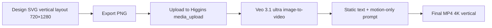

# Higgins vertical-video prompt iteration (vault-banner-animation pattern)

> [!info] When to use
> When generating a TikTok/Reels-ready vertical 9:16 short-video that needs to display **branded text or numbers** (logos, stats, wordmarks). The naive text-to-video approach fails on text-rendering; this pattern converges in 3 iterations on a single concept.

## The text-rendering failure of 2026-era video models

As of 2026-05, every consumer LLM-based video-gen model (Kling, Veo, Seedance, Runway) has **the same hard limitation**: AI-rendered text in video output is **illegible, abstract, or hallucinated**. This includes:

- 8-character monospace strings (e.g. `15,835`, `κ=0.708`)
- Wordmarks with letter-spacing (e.g. `MyForge Vault   11.11`)
- Multi-line captions with frontmatter-style data
- Code-blocks with syntax-highlighting

**Conclusion**: NEVER ask a video-gen model to render text. Design the text-bearing asset as static SVG/PNG first, then use the model only for motion.

## The 3-iteration convergence pattern

This is the empirical pattern from the 2026-05-20 TikTok-launch attempt:

### v1 — text-to-video (FAIL)

**Model**: Kling 3.0 std, 15 sec, 9:16
**Prompt**: 4-scene narrative with AI-rendered text overlays ("15 silent victims", "Open-source playbook")
**Result**: text comes out illegible/abstract; the "kinetic text counter" reads as smudge-pattern
**Verdict**: REJECT. Cost: 30 credits.

### v2 — image-to-video with horizontal-banner start_image (LETTERBOX FAIL)

**Model**: Veo 3.1 ultra, 8 sec, 9:16
**Approach**: upload existing 1280×640 (16:9) hero-banner.png as `start_image`, prompt animation-only
**Result**: video is technically vertical 9:16 (2160×3840), BUT the horizontal 16:9 content is letterboxed into the vertical canvas → **70% black margins top + bottom**
**Verdict**: REJECT. Cost: 48 credits.

### v3 — design-vertical-asset-first + image-to-video (SUCCESS)

**Step 1**: Author a NEW SVG at 720×1280 viewbox (9:16 vertical canvas) with **all branded text/numbers as static SVG elements** — wordmark, stats, axis-labels, CTA. ~200 lines of SVG.

**Step 2**: Export SVG → PNG at 720×1280 via `cairosvg.svg2png(output_width=720, output_height=1280)`. This is the **rendered asset** the video-model will animate.

**Step 3**: Upload PNG to Higgins → `start_image` for Veo 3.1 ultra.

**Step 4**: Prompt: "Cinematic 9:16 vertical motion-graphics polish of the input image. **NEVER add new text or change numbers.** Animate ONLY visual effects: pulse, glow, beams, twinkle, code-rain. No scene cuts. No camera motion. Pure motion-graphics polish of the existing layout."

**Result**: 4K (2160×3840) full-frame, edge-to-edge, all text legible (because it was PNG-static), all motion-graphics added by Veo (beam-flow, node-rotation, starfield-twinkle, glow-pulse).
**Verdict**: ACCEPT. Cost: 48 credits. Total spend: 126 credits ($0 with subscription).

## The key principle

> **Static text on a designed PNG + motion-only video-prompt + image-to-video model = legible, branded, animated.**

This works because:

1. The model NEVER tries to render the text (it's already in the PNG)
2. The model ONLY adds motion (which it does well)
3. The "edge-to-edge fill" comes from the PNG's native 9:16 aspect ratio (NOT model upscaling)

## Anti-patterns

- ❌ Ask Veo/Kling to render `MyForge Vault 11.11` as text in the video. Result: smudge or hallucinated letters.
- ❌ Use a horizontal 16:9 PNG as `start_image` for a 9:16 video. Result: letterboxed black margins.
- ❌ Multi-scene cut narrative ("Scene 1, Scene 2, …"). Result: text changes mid-scene, AI loses tracking, output is jumpy.
- ❌ "Animate text floating in space" prompts. Result: text becomes part of the motion, gets smudged.

## Recommended workflow

## Model-specific notes (2026-05)

| Model | aspect_ratios | duration_range | text rendering | image-to-video | Recommend |
|---|---|---|---|---|---|
| Kling 3.0 std | 9:16, 16:9, 1:1 | 3-15s | ❌ fail | ✅ start_image+end_image | Cinematic-motion, NOT text |
| Veo 3.1 ultra | 9:16, 16:9 | 4-8s | ❌ fail | ✅ start_image (max 1) | **Best for static-text + motion** |
| Cinematic Studio 3.0 | 9:16, 16:9, 1:1 | 4-15s | ❌ fail | ✅ start_image+end_image | Premium cinematic, slower output |
| Seedance 2.0 | 9:16, 16:9, 1:1 | 4-15s | ❌ fail | ✅ start+end+video+audio reference | Multi-SKU product video |
| Marketing Studio | 9:16, 16:9 | 4-15s | ❌ fail | ✅ avatars+medias | Marketing-Studio products, NOT tech-content |

For tech-content with branded numbers, **Veo 3.1 ultra + image-to-video** is the consistent winner.

## Empirikus eredmény

- **MyForge Vault TikTok-launch video** (2026-05-20):
  - Final: `10-raw/videos/2026-05-20-tiktok-vault-dashboard-v3.mp4` — 4K vertical 9:16, 8 sec, 24.8 MB
  - Iterations: 3 (Kling-text-fail → Veo-letterbox → vertical-SVG-Veo-success)
  - Total cost: 126 credits / 2611-credit balance → ~5% of monthly Higgins-budget
  - Content: hero-banner-v3-vertical (720×1280 SVG) animated with beam-flow + node-rotation + starfield-twinkle

## Kapcsolódó

- [[nano-banana-cli-gotchas]] — image-gen CLI gotchas
- [[../06-Audits/2026-05-20 TikTok-strategy deep-research briefing]] — magyar TikTok-launch briefing
- [[hn-launch-angle-selection-rubric]] — wedge-claim selection
