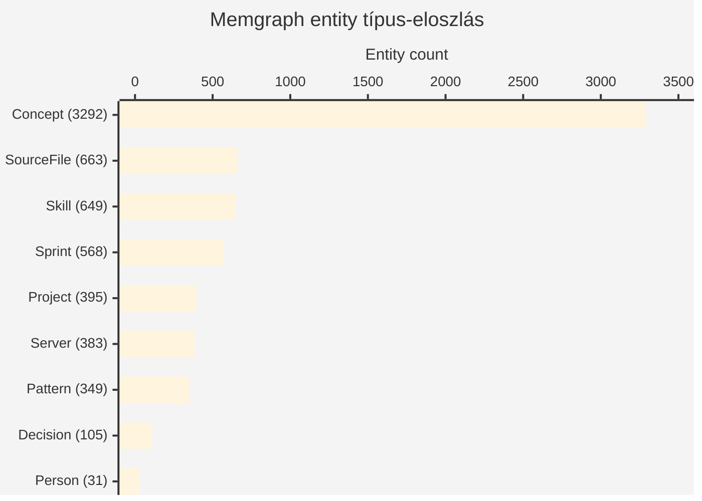

# Vault Knowledge Graph — Áttekintés

> [!info] Két komplementer extraction-réteg
> A vault knowledge-graph-ja **2-tier**: (1) **Memgraph LLM-extraction** (semantic entity-relation, 8997 entity / 6722 typed) és (2) **graphify deterministic tree-sitter + Leiden** (5846 node / 437 community, content-filtered). A két réteg egymást validálja — lásd [[two-tier-graph-extraction]].

## Live state (2026-05-18)

### Memgraph entity-graph (Tier-1, LLM-extracted)

| Metric | Érték |
|---|---|
| **Entity total** | 8 997 |
| **Typed entity** (≥ 1 label a `Entity` mellett) | 6 722 (74.7%) |
| **Untyped entity** (csak `Entity`) | 2 275 (25.3%) |
| **Alias edges** (`ALIAS_OF`) | 102 |
| **Top reláció-típusok** | `MENTIONS` 1 954 · `HAS_VALUE` 1 921 · `USES` 1 862 · `PRODUCES` 1 718 · `REQUIRES` 1 277 · `APPLIES_TO` 993 · `CAUSES` 688 |

### Címke-eloszlás (top-9 typed)



> [!note] Multi-label kombók
> 224 entitás kettős-vagy-tripla typed (pl. `Skill+Project` 107, `Concept+Pattern` 52, `Sprint+Pattern` 17). A `labels(n)` halmaz, ami a domain-overlap-et tükrözi.

### graphify deterministic (Tier-2, tree-sitter + Leiden)

| Metric | Érték |
|---|---|
| **Node count** (content-filtered) | 5 846 |
| **Edge count** | 5 479 |
| **Communities** (Leiden) | 437 |
| **Extraction time** | ~12 perc · $0 cost |
| **Output** | `/root/obsidian-vault/graphify-out/graph.html` (4.6 MB) + `graph.json` (4.3 MB) |

A graphify content-filtered, mert a teljes vault-on (`.obsidian/plugins/` + `10-raw/`-mal együtt) 18 102 node lett — érdemi-vizualizálhatatlan hairball. Lásd [[../05-Memory/Infrastructure#Large-graph viz hairball anti-pattern|hairball anti-pattern]].

## Top-10 hub-entitás (Memgraph fokszám-rank)

| # | Név | Címke(k) | Fokszám | Megjegyzés |
|---:|---|---|---:|---|
| 1 | `robbantott-kereso` | Project | 39 | KGC robbantott-keresor PDF→search projekt |
| 2 | `kgc-berles` | Project | 38 | Kisgépcentrum bérlés-portál |
| 3 | `Phase B-8` | Sprint | 32 | Vault entity-graph cleanup sprint |
| 4 | `11-wiki/Index.md` | SourceFile | 30 | Karpathy-wiki belépő |
| 5 | `SV-3` | Sprint | 28 | Subagent-fanout RSI sprint |
| 6 | `NotebookLM` | Skill | 26 | Deep-research toolchain |
| 7 | `subagent-fanout` | Concept | 24 | $0-cost bulk LLM-mutáció pattern |
| 8 | `SV-8` | Sprint | 23 | Recursive self-improvement sprint |
| 9 | `Memgraph` | Server | 22 | Graph-DB :7687 |
| 10 | `vault` | Entity | 22 | Untyped meta-hub (cleanup-candidate) |

## Vizualizáció-formák

### A. Lightweight overview SVG

- **Path:** `/root/projects/myforge-vault-1111/docs/knowledge-graph-overview.svg`
- **Tartalom:** top-60 hub + induced subgraph 11 internal edge (a hub-and-spoke természet miatt kevés internal — a hubok a low-degree node-okhoz kötnek)
- **Layout:** Fruchterman-Reingold force-directed (250 iter, Python static-render)
- **Méret:** 14.6 KB
- **Címke-szín:** Concept zöld · Pattern sárga · Skill kék · Project narancs · Server piros · Person lila · Decision barna · Sprint cián · SourceFile szürke
- **Node-méret:** `4 + 8 × √(deg / max_deg)` — sqrt-skálázás
- **Label:** csak top-30 hub-on (címke-takarás-elkerülés)

### B. Interaktív full-graph (graphify-out reuse)

- **Path:** `/root/projects/myforge-vault-1111/docs/graph/index.html` (4.6 MB)
- **Forrás:** `graphify-out/graph.html` direct-másolás
- **Load-time becslés:** ~10s első-load CDN nélkül, ~3-5s gzip-szel (GH Pages auto-gzip)
- **Tartalom:** 5846 node + 5479 edge + 437 community szín-kódolt
- **UX:** zoom · pan · node-search · community-isolate

### C. D3.js induced-subgraph viewer (Phase 2 — ÉLES 2026-05-18)

- **Path:** `/root/projects/myforge-vault-1111/docs/graph/viewer.html` (12.8 KB) + `top200.json` (13.0 KB)
- **Forrás:** Memgraph top-200 hub-entitás (fokszám-rank) + intra-edges (39 dedup, undirected)
- **D3:** v7 jsDelivr CDN (~80 KB external, browser-cached)
- **Total első-load:** ~106 KB (12.8 KB HTML + 13.0 KB JSON + ~80 KB D3 CDN) — **~43× kisebb** a Phase-1 4.6 MB-hoz képest
- **Features:**
  - Force-directed layout (d3-force) + d3-zoom (0.2×–4× scale-extent, drag-pan)
  - Per-label színkód (9 szín, sidebar legend with counts)
  - Filter-checkbox per-label (toggle visibility, dim inactive)
  - **Click-to-expand** — node-kattintás kiemeli a szomszédságot, többi node-ot dim-eli (client-side, no API)
  - Hover tooltip — név + label + degree (XSS-safe textContent)
  - Search input — substring filter node-name-en
  - Drag-rögzítés (drag node → fix position; release → free)
- **Mobile UX:** 200 KB első-load → 3G-n ~2–3s, 4G-n <1s. Sidebar 240→200 px <720 px viewport-on.

### D. Mkdocs nav integráció

A `mkdocs.yml` `nav:` szekcióban új top-level tab:

```yaml
- Knowledge Graph:
    - Áttekintés: wiki/vault-knowledge-graph-overview.md
    - Interactive viewer: graph/viewer.html      # Phase 2 — ~106 KB
    - Full (4.6 MB): graph/index.html            # Phase 1 — graphify reuse
```

Az interaktív HTML-ek static-asset-ként közvetlenül szerverülnek (GH-Pages auto-gzip).

## 2-tier extraction — mit mond melyik?

| Réteg | Erőssége | Gyengesége |
|---|---|---|
| **Memgraph LLM** | Semantic precision (`USES`, `CAUSES`, `BLOCKS` reláció-típusok), magyar-kontextus-érzékeny, evolving via subagent-fanout | $-cost minden run-re, prompt-drift, non-deterministic |
| **graphify tree-sitter + Leiden** | Determinisztikus, $0 cost, code-symbol-pontos, reprodukálható, community-aware | Csak syntactic structure (NEM semantic edges), nyelv-agnosztikus parsing limits |

**Verdict:** Memgraph a "semantic graph", graphify a "structural graph". A produkciós vault-search a **Memgraph-ot** használja (vector-index + cypher), a graphify a **deterministic anchor** (CI-be tehető regresszió-check). Részletek: [[two-tier-graph-extraction]].

## Engineering-honest finding (őszinte audit)

> [!warning] A 4.6 MB interactive graph hasznossága a public docs-on
> A `graph.html` 4.6 MB **kifejezetten nagy** statikus asset egy GH-Pages docs-site-on. Mobile-on lassan tölt, low-bandwidth (3G) felhasználó 30-60s. **Két alternatíva:**
>
> 1. **Tartsuk meg** — referenciaként + "deep-dive"-flagezve `[!warning] 4.6 MB, lassú mobile-on` callouttal, mert egyedi (5846-node interactive Leiden-community viz nem tipikus open-source-vault feature)
> 2. **Cseréljük D3-induced-subgraph-ra** — top-200 hub + intra-edges, ~150 KB inline-d3.js + JSON, zoom + click-to-expand, sokkal gyorsabb
>
> Ajánlás: **Phase 1 — másold be MOST** (zero-effort, már megvan), **Phase 2 — építsd ki a D3-induced-subgraph-ot** amikor lesz időkeret (~1 nap dev, magas ROI). A current commit a Phase 1.
>
> **Phase 2 update (2026-05-18):** ÉLES, lásd C. szekció — `viewer.html` 12.8 KB + `top200.json` 13.0 KB + D3 v7 CDN ~80 KB ≈ 106 KB total első-load (43× kisebb).

## Kapcsolódó

- [[two-tier-graph-extraction]] — miért két extraction-réteg
- [[../05-Memory/Infrastructure#Memgraph]] — Memgraph deploy-pattern
- [[memgraph-ce-feature-limits]] — vector-index + multi-namespace
- [[../06-Audits/2026-05-17 B-7 entity-graph state]] — eredeti audit (ha létezik)

## Regenerálás

```bash
# A. SVG overview
python3 /tmp/build_svg.py
# (forrás: /tmp/top100_full.json + /tmp/top100_edges.json a vault-graph-query-ből)

# B. Interaktív (Phase 1 — full graphify)
cd /root/obsidian-vault && graphify scan . --output graphify-out/ \
    --exclude '.obsidian/plugins/*' --exclude '10-raw/*'
cp graphify-out/graph.html /root/projects/myforge-vault-1111/docs/graph/index.html

# C. D3 induced-subgraph viewer (Phase 2 — top-200 + intra-edges)
/root/.notebooklm-venv/bin/python3 /tmp/extract_top200.py
# Writes: /root/projects/myforge-vault-1111/docs/graph/top200.json
# Viewer (viewer.html) static, only re-emit top200.json on regen.

# D. Wiki stats refresh
vault-graph-query "MATCH (n:Entity) RETURN count(n)" --json
```
