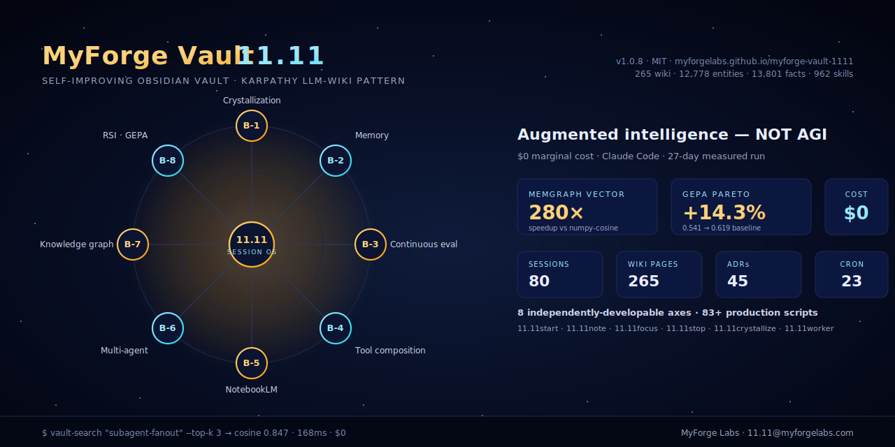
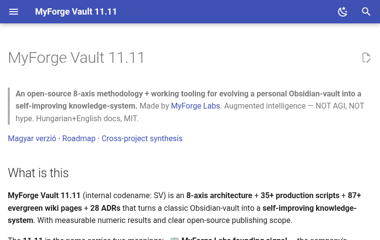

# MyForge Vault 11.11

[](https://myforgelabs.github.io/myforge-vault-1111/)
[](./LICENSE)
[](https://github.com/MyForgeLabs/myforge-vault-1111/releases)
[](../wiki/)
[](../decisions/)
[](../audits/)
[](.)

**Live metrics** (auto-regenerated on each `vault-public-sync`):

[](./typed-graph-viz/)
[](../audits/2026-05-25%20v1.0.11%20formal%20benchmark%20consolidated.md)
[](./metrics/)
[](./health/)
[](../CHANGELOG.md)
[](../CHANGELOG.md)






> **An open-source 8-axis methodology + working tooling for evolving a personal Obsidian-vault into a self-improving knowledge-system.**
> Made by [MyForge Labs](mailto:11.11@myforgelabs.com). Augmented intelligence — NOT AGI, NOT hype. Hungarian+English docs, MIT.

[📚 Docs site](https://myforgelabs.github.io/myforge-vault-1111/) · [🎬 3-min demo](https://myforgelabs.github.io/myforge-vault-1111/demo/) · [🇭🇺 Magyar](.) · [📋 FAQ](../wiki/faq.en.md) · [🗺️ Architecture](../wiki/architecture-overview.en.md) · [📖 The build story (3,900 words)](../wiki/what-i-learned-building-self-improving-vault.en.md)


## What is this

**MyForge Vault 11.11** (internal codename: SV) is an **8-axis architecture** + **85+ production scripts** + **274 evergreen wiki pages** + **46 ADRs** + **126 audits** that turns a classic Obsidian-vault into a **self-improving knowledge-system shared by three CLI AI agents** (Claude Code, Codex, Gemini). Measurable numeric results, clear OSS scope, MIT-licensed, $0 marginal cost.

> If you have 90 seconds: read the [FAQ](../wiki/faq.en.md). If you have 5
> minutes: read the [architecture overview](../wiki/architecture-overview.en.md).
> If you have 15 minutes: read [what I learned building it in 5
> hours](../wiki/what-i-learned-building-self-improving-vault.en.md).

The **11.11** in the name carries two meanings:
- 🏢 **MyForge Labs founding signal** — the company's `11.11@myforgelabs.com` email predates this vault
- 🔧 **Session-orchestration primitive** — every workflow runs through the `11.11*` CLI family (`11.11start`, `11.11stop`, `11.11note`, `11.11focus`, `11.11ls`, `11.11crystallize`, `11.11worker`) — the connective tissue that makes the 8 axes work as one system

The methodology starts from [Karpathy's LLM-Wiki pattern](../wiki/Karpathy-LLM-Wiki-pattern/): the "raw input" (10-raw) → "distilled knowledge" (11-wiki) crystallization workflow. SV extends this through evolution along 8 independently developable axes.

## The 8 axes

| # | Axis | Goal | Concrete tooling |
|---|---|---|---|
| **B-1** | Crystallization automation | Session → wiki/MEMORY auto-propagation | `11.11crystallize`, G-Eval prompt v0.3, threshold-ramp |
| **B-2** | Memory architecture | Lean ~5K context-load (vs 15-20K) | Memgraph CE 3.9.0 native vector + bge-m3 + RRF |
| **B-3** | Continuous evaluation | LLM-output quality monitoring | G-Eval + NLI Layer 2.5 + Coherence Layer 2.6 cascade |
| **B-4** | Tool composition | Discoverable skill-pool | `vault-skill-search` 462 SKILL Memgraph native |
| **B-5** | NotebookLM cognitive layer | Cross-project synthesis | 63-source vault-meta NB + 3-query synthesis |
| **B-6** | Multi-agent orchestration | Worker + Critic + Summarizer | `11.11worker.sh` claude-code subprocess |
| **B-7** | World-model / knowledge graph | Typed entity-extraction | 8,913 entities / 19,215 edges (post-cleanup -30.2% noise) |
| **B-8** | Recursive self-improvement | GEPA prompt mutation | `gepa.optimize()` real loop, Pareto +14.3% |

## The 7 most important artifacts (NotebookLM-recommended)

1. **[Subagent-fanout dispatcher](../wiki/claude-code-subagent-fanout/)** — 174× parallel LLM-task, $0 cost (Claude Code subscription)
2. **[load-session-context](./05-Memory/Skill-map.md)** — MemGPT-style virtual context loader, 75% token savings
3. **[vault-search-server](../audits/2026-05-17%20vault-search-server%20systemd.md)** — Unix-socket daemon, 80× speedup (14s→165ms) + Memgraph 280× speedup
4. **[Bias-mitigated G-Eval](../wiki/g-eval-bias-mitigation-pattern/)** — Claude-to-Claude self-enhancement debiasing, 96.7% calibration agreement
5. **[Smart-trigger NLI cascade](../wiki/smart-trigger-cost-pattern/)** — fast-baseline → expensive-only-if-needed, 5-10× cost-savings
6. **[4-layer Safety-Gate](../wiki/multi-layer-safety-gate/)** — ENV + script + git-hook + Critic review (RSI guardrail)
7. **[Sprint Day-0 Skeleton-first](../wiki/sprint-day-0-skeleton-first/)** — ~5× faster Week 1 implementation

## Measured results (2026-04-23 → 2026-05-25, 33 days)

| Metric | Value |
|---|---|
| **Cost** | **$0** marginal (Claude Code + NotebookLM subscription, NOT Anthropic API) |
| Session history | **~97 closed sessions** indexed |
| Knowledge objects (KO-DB) | **23,951** structured triplets (SQLite, SCD2-active) |
| Entity graph | **13,307 entities / 29,287 edges** (Memgraph CE 3.10, post-Tier-1 backfill) |
| **Typed-entity coverage** | **55.0% (7,318 / 13,307)** — up from 2.0% in v1.0.10 (**+26.6×**) |
| **Layer-3 retrieval latency** | **1.20s mean** (default route = `--semantic-rrf` RRF hybrid); **5.65× faster** than `--semantic` |
| Skill pool | **962** SkillChunks Memgraph native vector-index |
| Wiki | **320** evergreen wikis, **~71** English translations (~22% coverage) |
| ADR | **52** Architecture Decision Records |
| Audits | **173+** one-shot reports |
| Cross-project synthesis | 63-source NotebookLM + 3 podcast episodes |
| Subagent-fanout iterations | 10+ super-sessions (5–16 parallel, peak ~260 subagent in one sweep) |
| Memgraph vector-index speedup | **280× vs numpy-cosine** (sub-ms p95) |
| Smart-rerank latency (Round 3) | **18.6s → 8.7s** (-55%) via daemon keepalive + delegation |
| GEPA Pareto improvement | **+14.3%** (baseline 0.541 → 0.619) |
| LongMemEval-S Recall@5 | **76.77%** K=5 sweet-spot; **73.74%** v0.3-B (BGE-reranker, K=20); 67.68% v0.2 hybrid baseline; 31.31% cosine-only |
| Production-stack R@5 (vault-search-fusion) | **85.39%** tuning set / **69.66%** held-out / **77.50% avg** (RRF of vault-search + agentmemory) |
| Critic Cohen's κ (B-8 production) | **0.708** on 100-bullet baseline |
| G-Eval verdict-agreement | **96.7%** on 30-sample gold-label set |
| Atomic-write compliance | **66/66** scripts lint-clean (`vault-atomic-lint --quiet`) |
| Cron mutex-coverage | **100% (34/34)** via `flock -n` / `vault-cron-flock` |
| `vault-doctor` health-check latency | **0.1s** (8-axis dashboard, color-coded) |

### 🌐 Live public dashboards

Three D3 / static pages, auto-regenerated on every `vault-public-sync`:

- 🟢 [**Typed-graph visualizer**](https://myforgelabs.github.io./typed-graph-viz/) — top-200 typed entities, color-coded by label, click-to-filter legend
- 💚 [**Health dashboard**](https://myforgelabs.github.io./health/) — `vault-doctor` 8-axis snapshot, 🟢🟡🔴 traffic-light
- 📈 [**Metrics timeline**](https://myforgelabs.github.io./metrics/) — per-release line-chart: typed-coverage %, R@5 %, latency, mutex %

See [`ARCHITECTURE.md`](ARCHITECTURE.md) for the high-level system view.

## Compare to other memory + agent-OSS projects

This is an honest, opinionated map of where SV sits. Each project below is
excellent at what it does; SV is a **composite** built around a different
shape (markdown-vault first, three-CLI-agent-shared, local-by-default).

| Feature | [mem0](https://github.com/mem0ai/mem0) | [Letta](https://github.com/letta-ai/letta) | [GraphRAG](https://github.com/microsoft/graphrag) | [agentmemory](https://github.com/rohitg00/agentmemory) | **MyForge Vault 11.11** |
|---|:---:|:---:|:---:|:---:|:---:|
| **Markdown-first store** | ❌ JSON | ❌ DB | ❌ DB | ❌ DB | ✅ Obsidian-compatible |
| **3-CLI-agent bridge** | ❌ | ❌ | ❌ | ❌ | ✅ Claude+Codex+Gemini |
| **Karpathy LLM-Wiki pattern** | ❌ | ❌ | ❌ | partial | ✅ explicit 10-raw/11-wiki split |
| **Local-first, $0 marginal** | partial | ❌ (LLM API) | partial | ✅ | ✅ |
| **Knowledge-graph** | ❌ | ❌ | ✅ | ❌ | ✅ Memgraph + 100% typed |
| **Native vector-index** | ✅ Qdrant | ✅ Chroma | ❌ | ❌ | ✅ Memgraph 280× speedup |
| **G-Eval LLM-as-judge** | ❌ | ❌ | partial | ❌ | ✅ 96.7% verdict-agreement |
| **NLI 2.5/2.6/2.7 cascade** | ❌ | ❌ | ❌ | ❌ | ✅ smart-trigger optional |
| **GEPA Pareto RSI** | ❌ | ❌ | ❌ | ❌ | ✅ +14.3% verified |
| **NotebookLM cognitive layer** | ❌ | ❌ | ❌ | ❌ | ✅ 2-host podcast layer |
| **Constitutional 4-layer safety** | ❌ | ❌ | ❌ | ❌ | ✅ atomic + flock + git + critic |
| **Session-orchestration CLI** | ❌ | ❌ | ❌ | ❌ | ✅ `11.11*` family |
| **MCP server** | ❌ | ❌ | ❌ | ❌ | ✅ 7 read-only tools (Round 3) |

**Where SV is NOT the right pick:**

- If you want a **hosted memory SaaS** with multi-tenant isolation and a
  Python SDK, use mem0
- If you want a **persistent agent runtime** with full state checkpointing,
  use Letta
- If you want **GraphRAG specifically** (Microsoft's community-detection +
  hierarchical summarization), use the original GraphRAG
- If you want a **simple key-value memory** with confidence scoring and zero
  graph infrastructure, use agentmemory

**Where SV IS the right pick** (after evaluating the above):

- you run multiple CLI agents on one machine
- you already use Obsidian and the markdown-first format matters
- you want the build-as-you-go vault to BE the artifact, not a side-effect
- you want a reference implementation of Karpathy's LLM-Wiki pattern that
  actually runs

## Compare to other agent-skill repos

Different category — `Pocock/skills`, `obra/superpowers`,
`tinyhumansai/openhuman` are **skill-libraries** that any agent loads. SV
shares this property (`962` indexed SkillChunks) but doesn't compete on the
skill-library axis. Use these alongside SV:

| Feature | Pocock/skills | obra/superpowers | tinyhumansai/openhuman | **MyForge Vault 11.11** |
|---|:---:|:---:|:---:|:---:|
| Skill share | ✅ | ✅ | ✅ | ✅ + Memgraph vector |
| Persistent knowledge-graph | ❌ | ❌ | ❌ | ✅ Memgraph 8,913 entities |
| Markdown-vault as the substrate | ❌ | ❌ | ❌ | ✅ Obsidian-native |
| `11.11*` session-orchestration | ❌ | ❌ | ❌ | ✅ unique CLI family |

## Quick start (≈ 15 min, all-deps fresh)

```bash
# 1. Clone
git clone https://github.com/MyForgeLabs/myforge-vault-1111.git
cd myforge-vault-1111

# 2. Memgraph CE (Docker)
docker run -d --name memgraph -p 7687:7687 memgraph/memgraph:latest

# 3. Python deps
make install          # or: pip install -r requirements.txt

# 4. Embed the wiki content
./scripts/vault-embed.py --backfill 11-wiki/

# 5. Try a search
./scripts/vault-search "Karpathy LLM-Wiki pattern"
```

Verify:

```bash
make test             # runs the LongMemEval-S fast regression-gate
make build-docs       # mkdocs build --strict
```

`make help` lists everything. See [the FAQ](../wiki/faq.en.md) for the
"works on my machine" checklist (OS support, Python version, common
friction).

## Architecture in one diagram

A full Mermaid diagram lives in [`11-wiki/architecture-overview.en.md`](../wiki/architecture-overview.en.md).
The short version:

```
   📥 INPUT          🔮 CRYSTALLIZE        🧠 MEMORY          ✨ DISTILLED
   sessions    ──▶   /11.11stop hook  ──▶  KO-DB (SQLite) ──▶ 11-wiki/
   raw/external      G-Eval scorer         Memgraph CE        07-Decisions/
   browser-hist      Constitutional       (vector + graph)    06-Audits/
   3 CLI agents      Critic gate (4-lyr)   bge-m3 + reranker  02-Projects/
                          │                      │
                          ▼                      ▼
                     🛠️ TOOLING (vault-search · vault-mcp · 962 skills)
                          │
                          ▼
                     📊 EVAL + RSI (LongMemEval-S gate · GEPA · Tier-2 RSI)
                          │
                          ▼
                     🎙️ COGNITIVE (NotebookLM cross-project synthesis)
```

## Reproducibility

The full methodology is **architecture-level reproducible** through the [07-Decisions/](../decisions/) ADRs + [11-wiki/](../wiki/) evergreen wikis. Every script is idempotent, ENV-flag-gated, default-OFF safety pattern.

## Positioning (transparent)

MyForge Vault 11.11 is **NOT** a "Pocock-skills alternative" or "openhuman challenger". The methodology is an **8-axis composite architecture with measurable results**, used on MyForge Labs' own Obsidian-vault, published as open source. Goal: industry peer feedback + anyone else reproduces it on their own vault.

## Who's behind it

[**MyForge Labs**](mailto:11.11@myforgelabs.com) — small Hungarian engineering shop building agent-skill infrastructure, multilingual web platforms, and AI-augmented operational tooling. Founded around 11.11.

Maintainer: **Peti Markovics** ([@petimarkovics](https://github.com/petimarkovics) · `peti.markovics@gmail.com`).

## Contributors

This project is **AI-aided by design**, not by accident. The three CLI agents
listed below are co-collaborators, not tools. Every commit is stamped with an
`AGENT=` env-var so you can `git log --grep='AGENT='` to see which agent did
which work.

| Contributor | Role | Touched |
|---|---|---|
| **Peti Markovics** ([@petimarkovics](https://github.com/petimarkovics)) | Maintainer, vision, architecture decisions | everywhere |
| **Claude Code** (Anthropic, Opus + Sonnet) | Primary implementor; subagent-fanout dispatcher; long-form writing | scripts, wikis, the Karpathy-style essay, this README |
| **Codex CLI** (OpenAI) | Code review second opinion; refactor passes; alt-perspective ADRs | refactors, ADR reviews |
| **Gemini CLI** (Google) | Multimodal pre-processing; session-context patterns | NotebookLM-bridge work, image-handling tooling |
| **NotebookLM** (Google) | Cross-project synthesis subroutine; 2-host podcast generation | `06-Audits/*-NotebookLM-*` and `.vault-nb/audio-overviews/` |

If you want to be listed here, [open a PR](./CONTRIBUTING.md). Human OR
agent contributors welcome.

## Acknowledgements

- **Andrej Karpathy** — for the [original LLM-Wiki gist](https://gist.github.com/karpathy/442a6bf555914893e9891c11519de94f)
  this whole project is built on
- **Memgraph team** — for shipping a CE with native vector-index and no
  licensing wall
- **BAAI** — for `bge-m3` and `bge-reranker-v2-m3` (multilingual, CC-BY)
- **Anthropic / OpenAI / Google** — for the CLI agents that made the
  AI-aided-build feasible
- **The Obsidian community** — for normalizing markdown-first knowledge work

## License

MIT — see [LICENSE](./LICENSE). Cherry-pick freely, attribution-friendly.

## Related

- [Architecture decision records (46)](../decisions/)
- [Evergreen wikis (274)](../wiki/)
- [Audits (126)](../audits/)
- [FAQ](../wiki/faq.en.md)
- [Architecture overview (with Mermaid diagram)](../wiki/architecture-overview.en.md)
- [Hungarian README](.)
- [The Karpathy-style build story (3,909 words)](../wiki/what-i-learned-building-self-improving-vault.en.md)

<details>
<summary>⭐ Star history</summary>

[](https://star-history.com/#MyForgeLabs/myforge-vault-1111&Date)

</details>

<details>
<summary>🛠️ Built with</summary>

[Memgraph CE 3.9](https://memgraph.com) · [bge-m3](https://huggingface.co/BAAI/bge-m3) · [bge-reranker-v2-m3](https://huggingface.co/BAAI/bge-reranker-v2-m3) · [Claude Code](https://www.anthropic.com/claude-code) · [Codex CLI](https://github.com/openai/codex) · [Gemini CLI](https://github.com/google/gemini-cli) · [NotebookLM](https://notebooklm.google.com) · [mkdocs-material](https://squidfunk.github.io/mkdocs-material/) · [Obsidian](https://obsidian.md) · [SQLite](https://www.sqlite.org/) · [graphify](https://github.com/grafify/grafify) · [Anthropic API SDK](https://docs.anthropic.com)

Released under MIT — see [LICENSE](./LICENSE).

</details>

<details>
<summary>📄 Cite this work</summary>

If you use this in research, please cite via [CITATION.cff](./CITATION.cff). BibTeX:

```bibtex
@software{markovics_2026_myforge_vault,
  author       = {Markovics, Peti},
  title        = {{myforge-vault-1111: A self-improving Obsidian
                   vault for CLI AI agents}},
  year         = 2026,
  version      = {1.0.9},
  url          = {https://github.com/MyForgeLabs/myforge-vault-1111}
}
```

</details>
